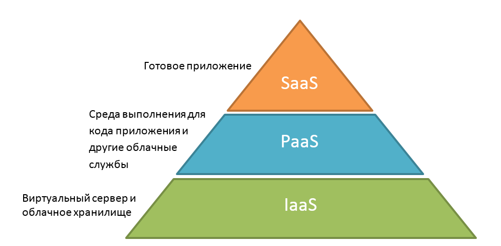

# Лабораторная работа 1. Знакомство с IaaS, PaaS, SaaS сервисами в облаке на примере Amazon Web Services (AWS). Создание сервисной модели.

## Цель работы:

Знакомство с облачными сервисами. Понимание уровней абстракции над инфраструктурой в облаке. Формирование понимания типов потребления сервисов в сервисной-модели.

## Дано:

1. Слепок данных биллинга от провайдера после небольшой обработки в виде SQL-параметров. Символ % в начале/конце означает, что перед/после него может стоять любой набор символов.
2. Образец итогового соответствия, что желательно получить в конце. В этом же документе

## Необходимо:

1. Импортировать файл .csv в Excel или любую другую программу работы с таблицами. Для Excel делается на вкладке Данные – Из текстового / csv файла – выбрать файл, разделитель – точка с запятой.
2. Распределить потребление сервисов по иерархии, чтобы можно было провести анализ от большего к меньшему (напр. От всех вычислительных ресурсов Compute дойти до конкретного типа использования - Выделенной стойка в датацентре Dedicated host usage).
3. Сохранить файл и залить в соответствующую папку на Google Drive.

## Алгоритм работы:

Сопоставить входящие данные от провайдера с его же документацией. Написать в соответствие колонкам справа значения 5 колонок слева, которые бы однозначно классифицировали тип сервиса. Для столбцов IT Tower и Service Family значения можно выбрать из образца.

## Выполнение самого задания

### Немножко теории...

IaaS (Infrastructure as a Service), PaaS (Platform as a Service) и SaaS (Software as a Service) — три основные модели обслуживания облачных технологий.

Очень кратко:

- IaaS (Infrastructure as a Service) - «Инфраструктура как услуга». Клиент арендует у провайдера вычислительные мощности его IT-инфраструктуры.
- PaaS (Platform as a Service) - «Платформа как услуга». Провайдер предоставляет пользователю готовую платформу для разработки, тестирования, развёртывания и управления приложениями.
- SaaS (Software as a Service) - «Программное обеспечение как услуга». Поставщик предоставляет готовое приложение, доступное через интернет.

### Теперь выполнение задания

**Номер варианта - 8** (так как мы восьмые в таблице)

1. Для начала я импортировала 2 файла с примером и с таблицей для заполнения в Excel по инструкции выше
2. Файл `AWS Example` - это пример, как должно было получится в итоге \
   (немножко объяснения всех колонок в файле и их значение >) \

Что пусто:

- `IT Tower` - высокоуровневая, стратегическая категория ИТ-ресурсов (как в компании отделы). В примере есть такие категории: Networking, Cloud Services и др. Для того, чтобы заполнить эту колонку, нужно посмотреть на сам сервис в `Product Code`
- `Service Family` - более детальная группа внутри `IT Tower` (как подразделения внутри отдела)
- `Service Type` - конкретное название сервиса AWS в читаемом формате
- `Service Sub Type` - вариация или конфигурация основного сервиса. Для того, чтобы заполнить, нужно смотреть в колонки `Usage Type` и `Operation`
- `Service Usage Type` - конкретный способ или метрика потребления сервиса на человеческом языке

Что уже заполнено:

- `Product Code` - уникальный идентификатор сервиса AWS в биллинговой системе
- `Usage Type` - детализация как именно использовался сервис
- `[lineItem/Operation]` - какое действие привело к возникновению затрат
- `lineItem/LineItemDescription` - текстовое описание из счета AWS

3. Теперь заполняем саму табличку (файл `AWS 8 team` в папке):

- Определение `IT Tower` и `Service Family` (1 и 2 колонки): из примера внизу есть соответствие категорий
- Определение `Service Type` (3 колонкочка): это просто отформатированный столбец `Product Code` (проставлены пробелы и тд)
- Определение `Service Sub Type` (4 столбец): тут чтение документации https://docs.aws.amazon.com/ + гугл + немножко придумать самим, если четких подтипов не нашли
- Определение `Service Usage Type` (5 столбец): тут тоже отформатированная колонка `Usage Type` + очень много гугла

### Итоги выполнения задания

Были выявлены вот такие сервисы:

#### IaaS

- **Управляемые файловые хранилища**: **Amazon FSx**

  - _Описание_: Полностью управляемый сервис для запуска высокопроизводительных файловых систем (Windows File Server, Lustre)
  - _Анализ использования_: В биллинге представлено потребление для Windows-систем: пропускная способность (`%ThroughputCapacity%`), объём хранилища (`%Storage%`), резервное копирование (`%BackupUsage%`), передача данных между зонами доступности (`%DataTransfer-Regional-Bytes%`)

- **Архивное хранилище**: **Amazon S3 Glacier**
  - _Описание_: Экономичный сервис для долгосрочного хранения редко используемых данных
  - _Анализ использования_: Объём данных (`%Bytes%`), время хранения (`%TimedStorage-ByteHrs%`), резервирование пропускной способности (`%ProvisionedCapacityUnit%`), API-запросы (`%Requests-Tier1/3%`), штраф за досрочное удаление (`%EarlyDelete%`)

#### PaaS

- **Платформа для машинного обучения**: **Amazon SageMaker**

  - _Описание_: Полностью управляемый сервис для всего жизненного цикла ML-моделей
  - _Анализ использования_: Биллинг детализирован по компонентам платформы: `SageMaker Studio` (блокноты — `%Notebk:%`), `SageMaker Training` (обучение — `%Train:%`), `SageMaker Processing` (обработка данных — `%Processing%`), `SageMaker Batch Transform` (пакетный инференс — `%Tsform%`), `SageMaker Inference` (развёртывание — `%Host:%`), `SageMaker Ground Truth` (разметка данных — `%TrSpt%`, `%LabeledObject%`)

- **Управляемый Kubernetes**: **Amazon Elastic Kubernetes Service (EKS)**

  - _Описание_: Сервис для запуска Kubernetes-кластеров без управления control plane
  - _Анализ использования_: Работа стандартных кластеров (`Standard EKS`) с использованием бессерверных нод Fargate (`%Fargate-vCPU-Hours%`, `%Fargate-GB-Hours%`)

- **Управляемая NoSQL база данных**: **Amazon DynamoDB**

  - _Описание_: Высокопроизводительная бессерверная NoSQL БД с автоматическим масштабированием
  - _Анализ использования_: Биллинг разделён по режимам: `Provisioned Capacity` (резервированная пропускная способность — `%Write/ReadCapacityUnit-Hrs%`) и `On-Demand Capacity` (оплата по запросам — `%Write/ReadRequestUnits%`), а также за дополнительные функции (`Backup & Restore`, `DynamoDB Streams`)

- **In-memory кэш для DynamoDB**: **Amazon DynamoDB Accelerator (DAX)**

  - _Описание_: Полностью управляемый кэш в памяти для ускорения чтения из DynamoDB
  - _Анализ использования_: Использование кэша (`%NodeUsage%`)

- **Платформа для веб-приложений**: **AWS Amplify**
  - _Описание_: Комплект инструментов для frontend-разработчиков (хостинг, CI/CD)
  - _Анализ использования_: Исходящий трафик хостинга (`%DataTransferOut%`), время сборки проекта (`%BuildDuration%`)

#### SaaS

- **Сервисы безопасности**: **Amazon GuardDuty** и **Amazon Inspector**

  - _Описание_: Полностью управляемые сервисы для обнаружения угроз и сканирования уязвимостей
  - _Анализ использования_: Плата за анализ событий безопасности (`%Paid/FreeEventsAnalyzed%`) и проведение оценок (`%agent-assessments%`, `%network-assessments%`)

- **Сервис резервного копирования**: **AWS Backup**
  - _Описание_: Централизованный управляемый сервис для автоматизации резервного копирования
  - _Анализ использования_: Хранение в холодном/тёплом хранилище (`%Cold/WarmStorage%`), восстановление из бэкапов (`%Restore-Cold/Warm%`), досрочное удаление (`%EarlyDelete-Cold%`)

## Вывод

В ходе лабораторной работы были изучены принципы классификации облачных сервисов по уровням абстракции (IaaS, PaaS, SaaS). На основе реальных биллинговых данных AWS была создана модель, которая преобразует технические записи о потреблении в структурированную аналитическую форму, то есть мы перевели модель с "технического" языка на "бизнес"-язык.

