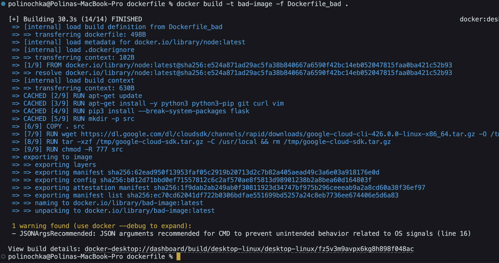
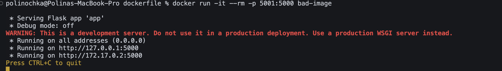
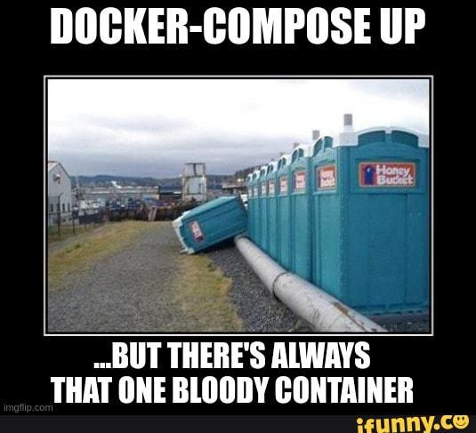

# Лабораторная работа №2 (Обычная + версия со звездочкой)

## Обычная лабораторная работа

### Цели

- Написать “плохой” Dockerfile, в котором есть не менее трех “bad practices” по написанию докерфайлов
- Написать “хороший” Dockerfile, в котором эти плохие практики исправлены
- В Readme описать каждую из плохих практик в плохом докерфайле, почему она плохая и как в хорошем она была исправлена, как исправление повлияло на результат
- В Readme описать 2 плохих практики по работе с контейнерами. ! Не по написанию докерфайлов, а о том, как даже используя хороший докерфайл можно накосячить именно в работе с контейнерами.

### Введение

Плохой Dockerfile — это такой Dockerfile, который приводит к неэффективным, небезопасным или труднообслуживаемым контейнерам: он долго собирается, создаёт слишком большой образ и может быть ненадежным и небезопасным.

### Выполнение работы

#### Плохой Dockerfile

(из /dockerfile/Dockerfile_bad)

```
FROM node:latest

RUN apt-get update
RUN apt-get install -y python3 python3-pip git curl vim
RUN pip3 install --break-system-packages flask

RUN mkdir -p src

COPY . src

RUN wget https://dl.google.com/dl/cloudsdk/channels/rapid/downloads/google-cloud-cli-426.0.0-linux-x86_64.tar.gz -O /tmp/google-cloud-sdk.tar.gz
RUN tar -xzf /tmp/google-cloud-sdk.tar.gz -C /usr/local && rm /tmp/google-cloud-sdk.tar.gz

RUN chmod -R 777 src

CMD python3 src/app.py
```

#### Почему этот Dockerfile плохой?

1. `FROM node:latest` \
   Что тут происходит: мы берем последнюю версию образа Node.js \
   Почему плохо: при использовании `latest` появляется уязвимость, тк при пересборке может поменяться версия Node.js, что приведёт к сломанной сборке
2. ```
   RUN apt-get update
   RUN apt-get install -y python3 python3-pip git curl vim
   ```
   Что тут происходит: мы обновляем список пакетов и устанавливает Python и утилиты \
   Почему плохо:
   - Несколько `RUN` подряд: каждый создаёт новый слой, увеличивает размер образа;
   - Нет очистки кеша: временные файлы остаются в слое;
   - Нет `--no-install-recommends`, поэтому устанавливаются ненужные пакеты: образ ещё больше.
3. `RUN pip3 install --break-system-packages flask` \
   Что тут происходит: мы устанавливаем библиотеку flask \
   Почему плохо:
   - Нет фиксированных версий пакета, поэтому при пересборке можно получить разные версии;
   - Нет очистки кэша.
4. ```
   RUN mkdir -p src
   COPY . src
   ```
   Что тут происходит: создаем новую папку src и копируем туда все содержимое текущей папки \
   Почему плохо: при копировании всего содержимого могут скопироваться ненужные файлы (например, .env с ключами и токенами), что понижает безопасность

5. ```
   RUN wget https://dl.google.com/... -O /tmp/google-cloud-sdk.tar.gz
   RUN tar -xzf /tmp/google-cloud-sdk.tar.gz -C /usr/local && rm /tmp/google-cloud-sdk.tar.gz
   ```
   Что тут происходит: мы скачиваем Google Cloud SDK и распаковываем его \
   Почему плохо: каждый `RUN` создаёт отдельный слой, поэтому даже после удаления архива размер слоя не уменьшается.
6. `RUN chmod -R 777 src` \
   Что тут происходит: мы даём всем файлам максимальные права (чтение, запись, выполнение) для всех пользователей \
   Почему плохо: опасно для безопасности, так как любой процесс внутри контейнера может изменить или удалить файлы
7. `CMD python3 src/app.py` \
   Что тут происходит: мы запускаем Python-приложение при старте контейнера \
   Почему плохо: сигналы операционки обрабатываются некорректно, тк это строковая форма команды

#### Хороший Dockerfile

(из /dockerfile/Dockerfile_good)

```
FROM node:22-slim

WORKDIR /usr/src/app

COPY requirements.txt .

RUN apt-get update && \
    apt-get install -y --no-install-recommends python3 python3-pip git curl wget vim && \
    pip3 install --break-system-packages --no-cache-dir -r requirements.txt && \
    wget https://dl.google.com/dl/cloudsdk/channels/rapid/downloads/google-cloud-cli-426.0.0-linux-x86_64.tar.gz -O /tmp/google-cloud-sdk.tar.gz && \
    tar -xzf /tmp/google-cloud-sdk.tar.gz -C /usr/local && \
    rm /tmp/google-cloud-sdk.tar.gz && \
    rm -rf /var/lib/apt/lists/*

COPY . .

RUN useradd -m appuser && chown -R appuser:appuser /usr/src/app
USER appuser

EXPOSE 5000

CMD ["python3", "app.py"]
```

Также был создан файл `requirements.txt` для управления Python-зависимостями:

```
flask==3.0.3
```

Зачем? Повышает воспроизводимость сборки (всегда одна и та же версия пакета), упрощает обновление библиотек \
Также был добавлен `.dockerignore` для исключения лишних файлов из контекста сборки:

```
node_modules
.git
__pycache__
*.log
*.pyc
.env
.DS_Store
venv
```

Что изменилось?
| Исправление в хорошем Dockerfile | Что это дает |
|------|------|
| `FROM node:latest` заменён на `FROM node:20-slim` | Образ стал стабильным, устанавливается легкий образ Node.js |
| Несколько отдельных `RUN`-команд (`apt-get`, `pip3 install`, `wget` и т.д.) были объединены в один `RUN` с логическими операторами && | Количество слоёв уменьшилось, размер итогового образа стал меньше |
| Был добавлен флаг `--no-install-recommends` при установке пакетов | Теперь устанавливаются только необходимые зависимости, без лишних пакетов |
| Python-зависимости раньше устанавливались напрямую в Dockerfile, а теперь создан отдельный файл `requirements.txt` и подключён через `pip install -r` | Появилась повторяемость сборки и кеширование зависимостей |
| В `requirements.txt` версии теперь закреплены (`flask==3.0.3`) | Исключена вероятность ошибок при пересборке |
| `RUN cd /usr/src/app` изменилось на `WORKDIR /usr/src/app` | Рабочая директория теперь фиксируется корректно (запускается эта директория для дальнейших слоев) |
| Скачивание и распаковка Google Cloud SDK объединено в одном `RUN` | Большой архив удаляется в том же слое, поэтому он не занимает место в образе |
| Раньше применялось `RUN chmod -R 777 src`, а теперь вместо этого создаётся пользователь `appuser` с собственными правами | Повышена безопасность, нет избыточных прав доступа |
| Раньше контейнер запускался от `root`, а теперь добавлено `USER appuser` | Контейнер теперь работает от непривилегированного пользователя |
| `CMD python3 app.py` заменён на `СMD ["python3", "app.py"]` | Правильная обработка сигналов операционной системы, более корректный запуск |

### Скриншоты

Сборка плохого образа:

(Образ собрался, но вылезло предупреждение, что последнюю команду нужно написать в json формате, что было исправлено в хорошем файле)

(Образ действительно собрался)

(Тут контейнер даже смог запуститься, тк я немного подкорректировала пути к файлам, но все же иногда плохие практики могут мешать запуску контейнера, т.е он может сразу же падать из-за несуществуюших, например, ссылок)

Сборка хорошего образа:


## Лабораторная работа 2 со звездочкой

### Цели

- Написать “плохой” Docker compose файл, в котором есть не менее трех “bad practices” по их написанию
- Написать “хороший” Docker compose файл, в котором эти плохие практики исправлены
- В Readme описать каждую из плохих практик в плохом файле, почему она плохая и как в хорошем она была исправлена, как исправление повлияло на результат
- После предыдущих пунктов в хорошем файле настроить сервисы так, чтобы контейнеры в рамках этого compose-проекта так же поднимались вместе, но не "видели" друг друга по сети. В отчете описать, как этого добились и кратко объяснить принцип такой изоляции

### Введение

Плохой Dockercompose - это такой файл, который приводит к неправильному управлению сетями, дублированию конфигурации, сложной поддержке, лохой безопасности, неоптимальному использованию ресурсов. Даже при хорошем Dockerfile плохой Compose-файл может сделать запуск и работу контейнеров небезопасной или нестабильной.

### Выполнение работы

#### Плохой Docker compose

(из /lab2/dockercompose/Dockercompose_bad.yml)

```
version: '3'

services:
  web:
    build: .
    ports:
      - "5000:5000"
    environment:
      - FLASK_ENV=development
      - APP_PORT=5000
    volumes:
      - .:/app
    network_mode: bridge
```

#### Почему этот Docker compose плохой?

1. Монтируется весь проект как volume — `.:/app`
   Почему плохая практика: Это может подтянуть мусор (например, `.git`, временные файлы).
2. Переменные окружения прописаны прямо в файле
   Это неудобно поддерживать и обновлять.
3. Принудительно указан network_mode: `bridge`
   Ломает управление сетью в Compose и усложняет изоляцию.

#### Хороший Docker compose

(из /lab2/dockercompose/Dockercompose_good.yml)

```
version: '3.8'

services:
  web:
    build: .
    ports:
      - "${APP_PORT}:${APP_PORT}"
    env_file:
      - .env
    networks:
      - isolated_net

networks:
  isolated_net:
    internal: true
```

#### Так же были созданы файлы:

- `.env` - для хранения переменных окружения, используемых в Dockerfile и docker-compose.yaml.
- `.env.example` - это шаблон для создания собственного .env файла другими пользователями.
- `app.py` - это простое Flask-приложение, которое используется для демонстрации работы контейнера.
- `Dockerfile` - инструкция по сборке образа контейнера на основе Python/Flask.

## Что изменилось?

| Исправление в хорошем Compose-файле                                                             | Что это даёт                                                                                                                       |
| ----------------------------------------------------------------------------------------------- | ---------------------------------------------------------------------------------------------------------------------------------- |
| `network_mode: bridge` заменён на собственную сеть `isolated_net` с параметром `internal: true` | Изолировали контейнер на сететевом уровне. Повышена безопасность.                                                                  |
| Удалён volume `.:/app`                                                                          | Исключены риски случайной утечки лишних или чувствительных файлов внутрь контейнера.                                               |
| Добавлен `.env.example`, а `.env` — в `.gitignore`                                              | Пример `.env` помогает другим разработчикам быстро настроить окружение, а `.gitignore` защищает от утечек конфиденциальных данных. |
| Используется версия `3.8` вместо `3`                                                            | Расширенные возможности Docker Compose, включая управление сетями и переменными окружения.                                         |



