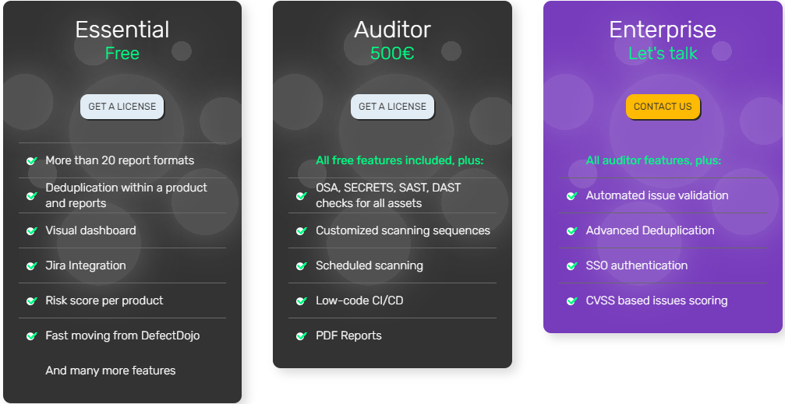

# AppSec Portal
[whitespots.io](https://whitespots.io/)

**AppSec Portal** is a comprehensive vulnerability 
discovery solution for all stages of software development. 
 With AppSecPortal, you can fully automate vulnerability 
management and get instant information on the security 
status of your applications and web assets 24/7.

Expand to see more screenshots

## Latest stable release tag

## Unstable release tag
latest

## Functions and features
AppSec Portal offers many features to keep your business secure, including:

* Integration with the software development lifecycle automates all security tasks such as vulnerability scanning, task creation in Jira, deduplication and more, saving hundreds of hours of work each month.
* Supports a variety of report formats for seamless integration with a wide range of popular scanners, including code scanners, secrets scanners, web scanners and many others.
* Ability to run scheduled scans of all IT assets such as repositories, Docker images, web domains and hosts.
* Measure and monitor application security health using metrics such as
* Risk-weighted trend (overall and per product)
  * Number of vulnerabilities by severity over time
  * Average time to validate/deny vulnerabilities
  * Average time to assign/remediate tasks
  * Manual/automated remediation status
* Consolidate reports from all scanners into one tool
* Automatic detection and removal of duplicate vulnerabilities.
* Validate and reject tasks using automation rules.
* Create tasks in Jira immediately after validation.
* Detailed, customisable reports with various metrics relevant to security regulators.

## Examples of Usage
AppSec Portal can be used to

- Track and manage the security of different products in your organisation.
- Integrate with existing workflows to respond quickly to new vulnerabilities.
- Generate reports for auditors and stakeholders to demonstrate security levels.
## License
To obtain a license for AppSec Portal, register for an account on [store.whitespots.io](https://store.whitespots.io/)  and request a license or [contact sales](mailto:sales@whitespots.io "sales@whitespots.io").

**Free version**
- More than 20 report formats
- Deduplication within a product and reports
- Visual dashboard 
- Jira Integration
- Risk score per product
- Fast moving from DefectDojo

**Paid version**

Depending on the paid plan you choose, you get the following additional premium features:

- OSA, SECRETS, SAST, DAST checks for all assets
- Customized scanning sequences
- Scheduled scanning
- Low-code CI/CD
- PDF Reports
- Automated issue validation
- Advanced Deduplication
- SSO authentication
- CVSS based issues scoring

For more features see our [documentation](https://docs.whitespots.io/appsec-portal/features).

**Additional services**
 For corporate support please contact your manager or [sales@whitespots.io](mailto:sales@whitespots.io)

## Documentation

Visit our [documentation web page](https://docs.whitespots.io/) to access guides on how to use AppSec Portal. 

## System requirements
 
* Minimum system resources: 4 GB of RAM and 2 CPU cores.
* Free disk space for installation and data storage of the portal.
* Network access for external users (users must be able to connect to the portal over the network).</e>

## Deployment process

### Installation

  
See step-by-step [installation guide](https://docs.whitespots.io/appsec-portal/install)

### Update
  
See how [to update](https://docs.whitespots.io/appsec-portal/install/update) your AppSec Portal 

## Feedback
If you have any questions or suggestions for improving the AppSec Portal, please contact us.

    

